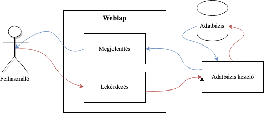
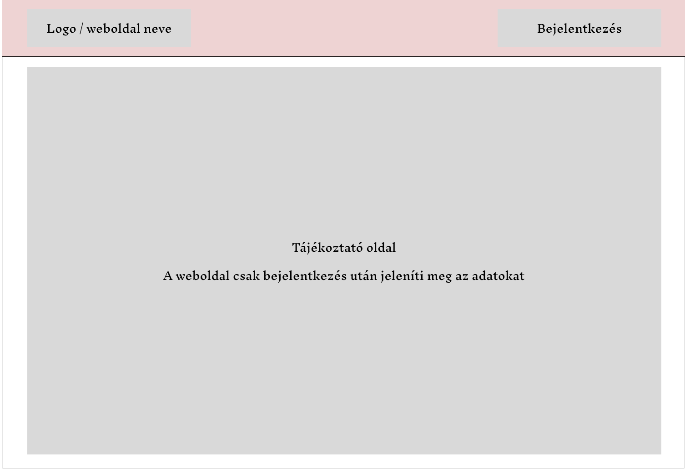
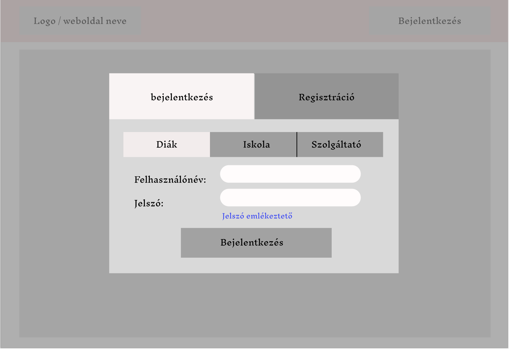
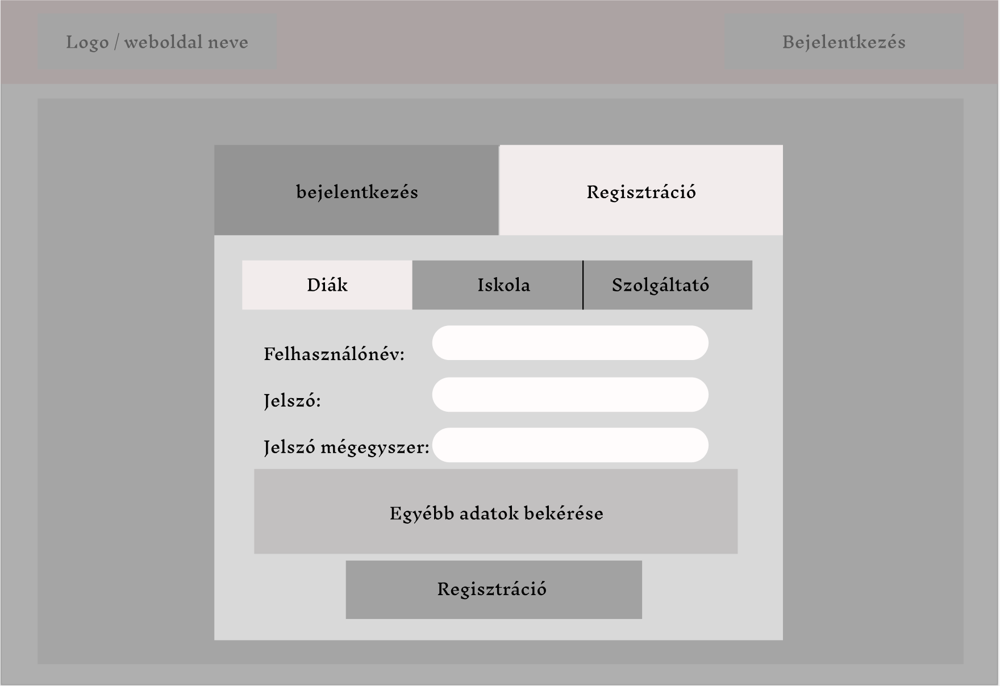

# Funkcionális specifikáció
 
## Jelenlegi helyzet leírása
 A mai középiskolások számára elengedhetetlen az 50 óra közösségi szolgálat teljesítése az érettségi megszerzéséhez. A rohanó világban szeretnénk minél egyszerűbben hozzáférni a kívánt információkhoz és mindent digitalizálni. Sok közösségi szolgálatot nyújtó szervezet nehezen tudja elérni a diákokat, hogy tájékoztassák a náluk lévő lehetőségekről, valamint a diákoknak nehézséget okoz információt szerezni a lehetőségeikről. 
Webalkalmazásunk célja, hogy segítsük a diákokat tájékoztatni a különböző közösségi szolgálatok lehetőségeiről. A diákok tudnak szűrni a közelükben lévő lehetőségekről, fel tudják venni a kapcsolatot a szervezet koordinátorával, tudnak üzenetet küldeni a tanároknak, valamint automatikus üzenetet kapnak, ha megjelenik egy új lehetőség. 

## A rendszer céljai és nem céljai !!!!!

## Vágyálomrendszer leírása

## Jelenlegi üzleti folyamatok leírása

## Igényelt üzleti folyamatok leírása
Azért hogy egyszerűbbé tegyük a diákok a tanárok és a szolgáltatók
feladatát, létrehozunk egy weboldalt ami a mai kornak megfelelően
helyt tud állni az elektronikai világban. A szolgáltatóknak egyszerūbb lesz,
mert a náluk végezhetõ közösségi munkák több diákhoz jut el a webalkalmazás
segítségével és az adminisztrációs feladatokat könnyebben elvégezhetöl. Az iskoláknak
a partnerrel egyszer kell szerzõdniük és ha ez már megtörtént akkor ezt a diákok látják
a munka választásánál így már ezzel sincs több teendõ.
A diákoknak is sokkal jobb, mert egyszerübben tudnak tájékozódni az aktuális
közösségi munkákról és a leigazoló dokumentumokkal is kevesebb teendõ van.
Mivel minden adminisztrációs feladat online mūködik igy sok idõt sporolunk meg vele 
és e mellett nem kel nyomtatásokat végezni amivel a környezetünkre is oda figyelünk.

## Használati esetek !!!!
bb funkciókat, használati eseteket és szereplőket.
### 1. Felhasználók és szerepek

#### 1.1 Admin
- Létrehozhat és kezelhet iskolákat, diákokat , és szolgáltatókat
- Képes jóváhagyni vagy elutasítani szerződéseket iskolák és szolgáltatók között
- Felhasználói fiókokat tud kezelni és szükség esetén letiltani

#### 1.2 Iskola
- Szerződést köthet a szolgáltatókkal
- Hozzáférhet a diákjaihoz és kezelheti őket
- Keresést végezhet a szolgáltatások között, amelyekkel az iskola szerződést kötött

#### 1.3 Diák
- Keresési lehetőség a szolgáltatások között város, megye, kategória és iskolai szerződések alapján
- Megtekintheti az elérhető szolgáltatásokat és jelentkezhet rájuk
- Láthatja a saját iskolája által jóváhagyott szolgáltatásokat

#### 1.4 Szolgáltató
- Hirdethet közösségi szolgálati munkákat
- Kezelheti a jelentkezéseket és elfogadhat vagy elutasíthat diákokat
- Megtekintheti az iskolai szerződéseit
- Leigazolhatja az elvégzett órákat és ha megvan az 50 akkor a munkát

### 2. Szerződéskezelés/ leigazoló nyilatkozat

#### 2.1 Új szerződés hozzáadása
- Az iskolák képesek új szerződéseket kötni szolgáltatókkal

#### 2.2 Szerződések jóváhagyása/elutasítása
- Az adminnak lehetősége van jóváhagyni vagy elutasítani a szerződéseket

#### 2.3 50 óra leigazolása
- A szolgáltató online folyamatosan tudja leigazolni az órákat a munka végzése közben
- Záró igazolás kiállítása 50 óra elvégzése után

### 3. Keresés és szűrés

#### 3.1 Szolgáltatások keresése

- Megye szerint
- Település szerint
- Iskola által partner szolgáltató szerint
- Kategória szerint

### 4. Felhasználói fiók kezelése

#### 5.1 Fiók létrehozása/bejelentkezés

- Minden felhasználó képes létrehozni egy fiókot és bejelentkezni
- Felhasználók a következő információkat adják meg a regisztráció során:
  Diák:
  Iskola:
  Szolgáltató: 
- A jelszónak megfelelő erősségűnek kell lennie
- Az alkalmazásnak ellenőriznie kell az e-mail cím formátumát és egyediségét a rendszerben
- Regisztrált felhasználók bejelentkezhetnek az alkalmazásba a megadott e-mail cím és jelszó segítségével.

#### 5.2 Elfelejtett jelszó funkció

-A felhasználók elfelejtett jelszó esetén kérhetnek jelszó-visszaállítási e-mailt

### 6. Biztonság és adatvédelem

- Az alkalmazásnak megfelelő biztonsági intézkedéseket kell biztosítania a felhasználói adatok védelme érdekében. Ideálisan a jelszavakat biztonságosan kell tárolni és az adatok titkosítását kell alkalmazni.

## Követelménylista

### Funkcionális követelmények
#### Funkcionális követelmények csoportosítása
#### Weblap követelményei

#### A tanuló adatbázis követelményei

#### A prediktáló program követelményei

### Nem-funkcionális követelmények

#### Nem-funkcionális követelmények csoportosítása

#### Tanuló adatbázis tartalma

##### Adatoszlopok

#### Predikció nem-funkcionális követelményei

#### Weboldal nem-funkcionális követelményei

## Képernyőtervek !!!

### Kezdőlap

#### Számítógépes felület:

#### Telefonos felület:
