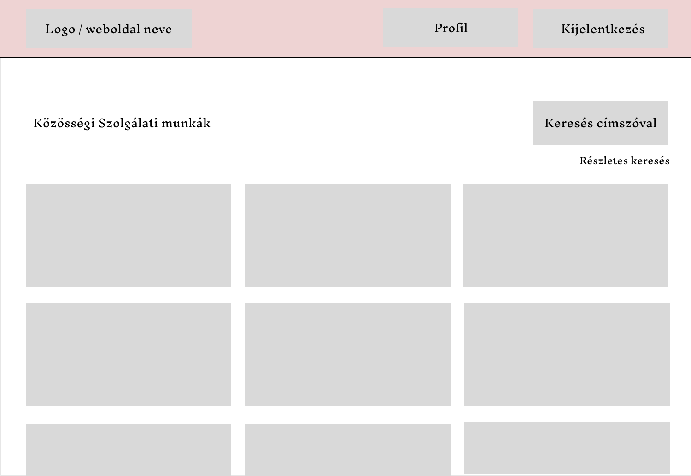
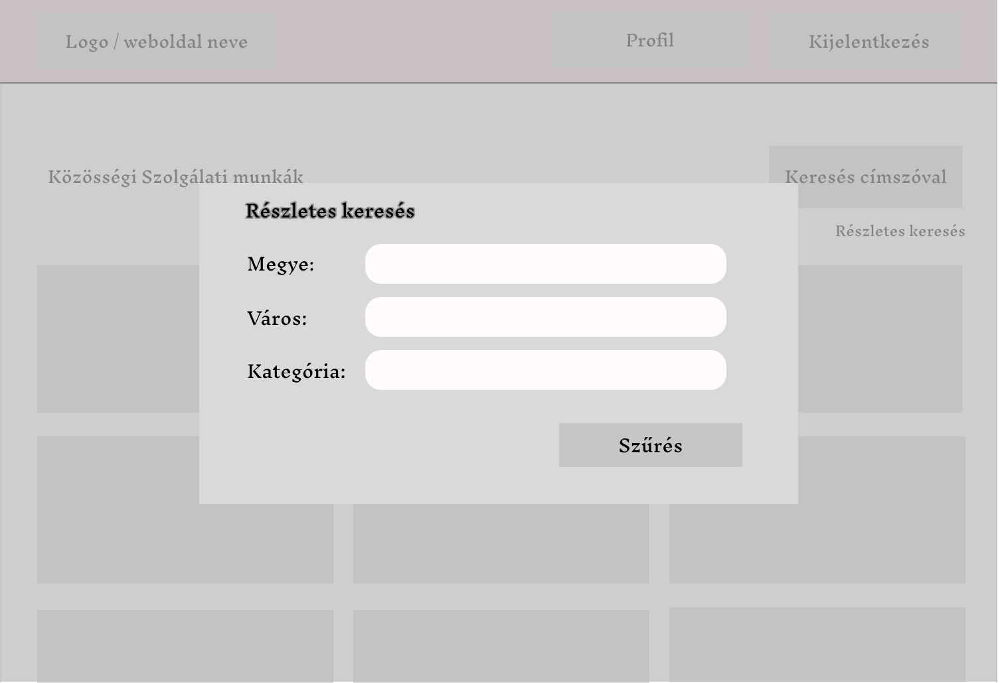
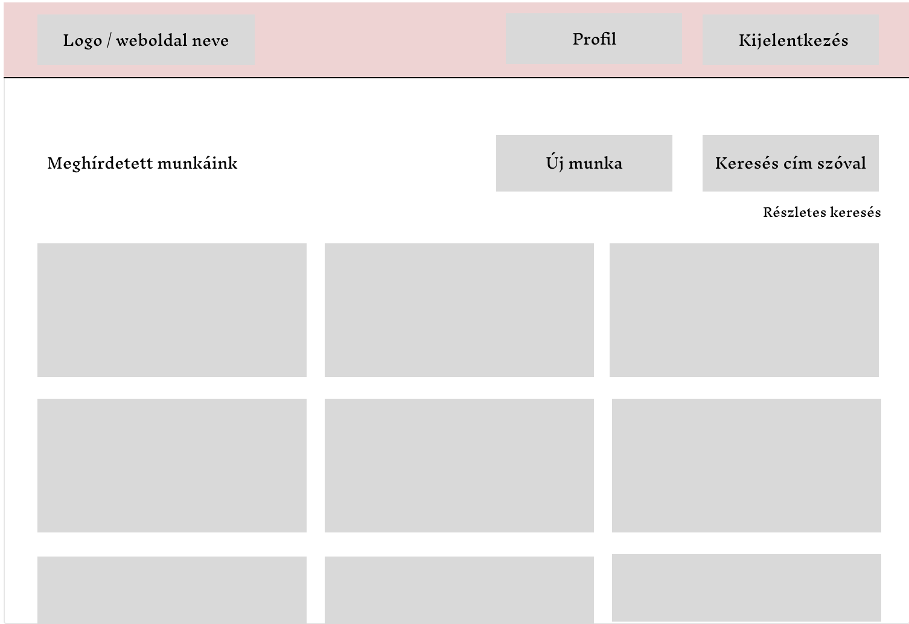
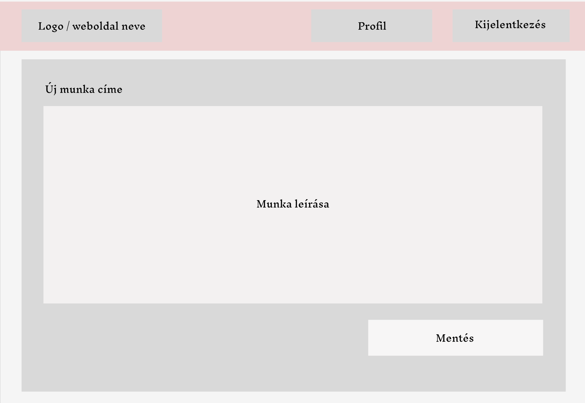
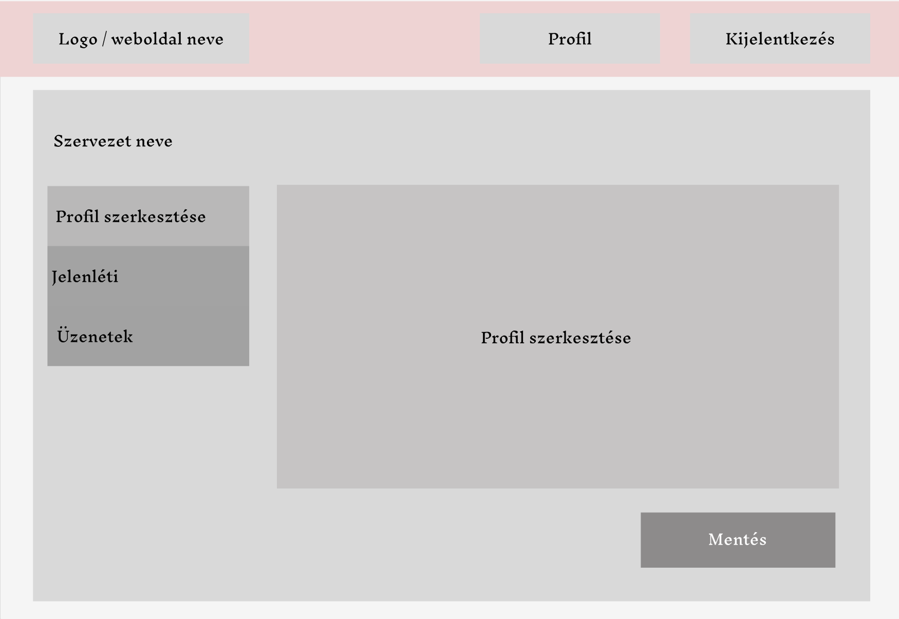
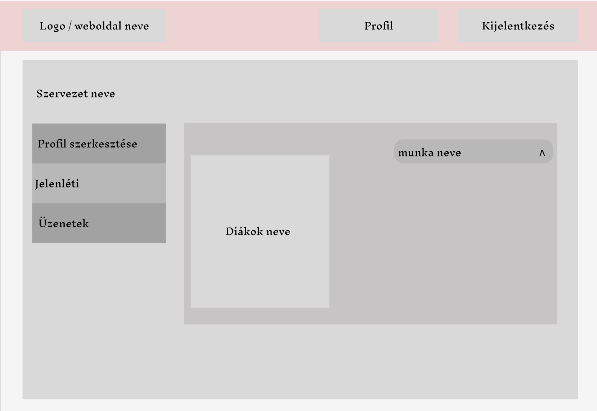
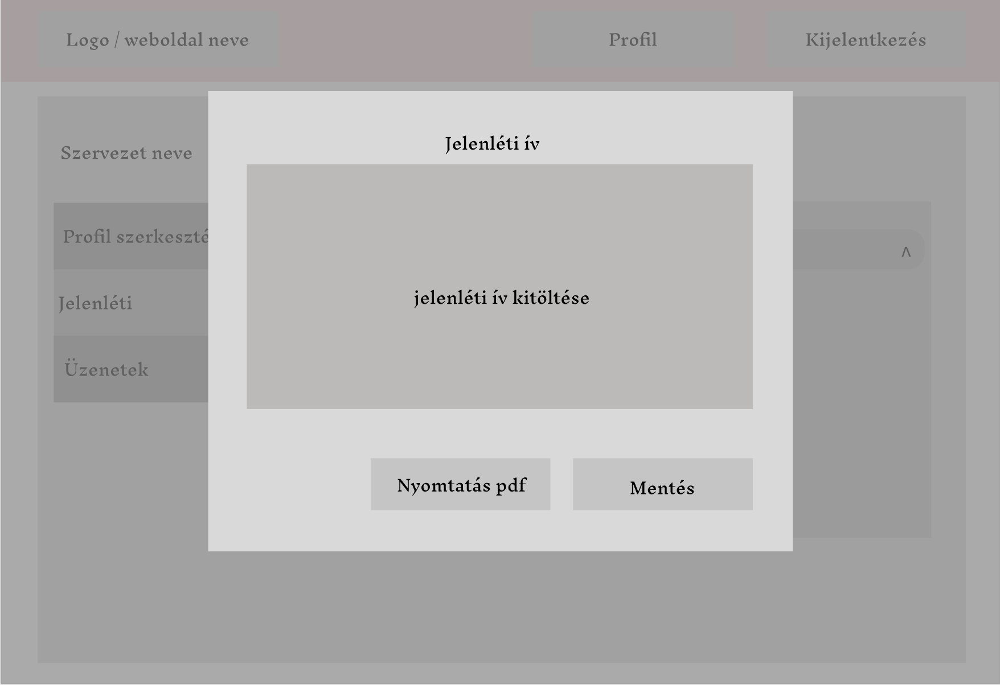
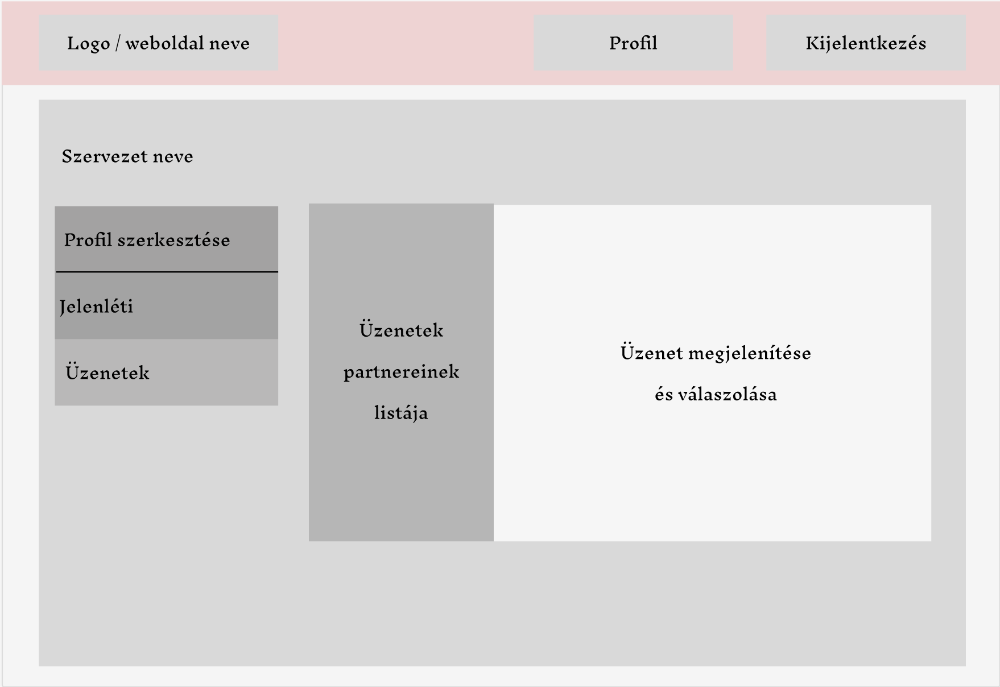

# Funkcionális specifikáció
 
## Jelenlegi helyzet leírása
 A mai középiskolások számára elengedhetetlen az 50 óra közösségi szolgálat teljesítése az érettségi megszerzéséhez. A rohanó világban szeretnénk minél egyszerűbben hozzáférni a kívánt információkhoz és mindent digitalizálni. Sok közösségi szolgálatot nyújtó szervezet nehezen tudja elérni a diákokat, hogy tájékoztassák a náluk lévő lehetőségekről, valamint a diákoknak nehézséget okoz információt szerezni a lehetőségeikről. 
Webalkalmazásunk célja, hogy segítsük a diákokat tájékoztatni a különböző közösségi szolgálatok lehetőségeiről. A diákok tudnak szűrni a közelükben lévő lehetőségekről, fel tudják venni a kapcsolatot a szervezet koordinátorával, tudnak üzenetet küldeni a tanároknak, valamint automatikus üzenetet kapnak, ha megjelenik egy új lehetőség. 

## A rendszer céljai és nem céljai 
### A rendszer céljai

- Egy olyan rendszer létrehozása, amelyet könnyű minden felhasználónak használnia, megértenie
- A rendszer gyors működésének biztosítása
- A felhasználók személyes adatainak védelme
- Bármilyen gépi eszközön működjön a webes alkalmazás, internetes kapcsolat feltétele mellett
- A felhasználót tájékoztassa az aktuális közösségi szolgálati munkákról
- Lehetővé tenni a diákok számára, hogy keressenek közösségiszolgálati munkákat megye, kategória és város alapján
- Biztosítani, hogy az iskolák és a szervezetek online kössenek közösségiszolgálati szerződéseket
- Lehetővé tenni a szervezet számára, hogy online igazolja a diákok által elvégzett 50 órás közösségiszolgálati munkát

### Nem céljai

- A szerződéskötési folyamatoknak offline módja nem kerül támogatásra
- A rendszer nem tervezett olyan funkciókat támogatni, amelyek kereskedelmi célú közösségiszolgálati munkákra vonatkoznak

## Vágyálomrendszer leírása

## Jelenlegi üzleti folyamatok leírása

## Igényelt üzleti folyamatok leírása
Azért hogy egyszerűbbé tegyük a diákok a tanárok és a szolgáltatók
feladatát, létrehozunk egy weboldalt ami a mai kornak megfelelően
helyt tud állni az elektronikai világban. A szolgáltatóknak egyszerūbb lesz,
mert a náluk végezhetõ közösségi munkák több diákhoz jut el a webalkalmazás
segítségével és az adminisztrációs feladatokat könnyebben elvégezhetöl. Az iskoláknak
a partnerrel egyszer kell szerzõdniük és ha ez már megtörtént akkor ezt a diákok látják
a munka választásánál így már ezzel sincs több teendõ.
A diákoknak is sokkal jobb, mert egyszerübben tudnak tájékozódni az aktuális
közösségi munkákról és a leigazoló dokumentumokkal is kevesebb teendõ van.
Mivel minden adminisztrációs feladat online mūködik igy sok idõt sporolunk meg vele 
és e mellett nem kel nyomtatásokat végezni amivel a környezetünkre is oda figyelünk.

## Használati esetek 

### 1. Felhasználók és szerepek

#### 1.1 Admin
- Létrehozhat és kezelhet iskolákat, diákokat , és szolgáltatókat
- Képes jóváhagyni vagy elutasítani szerződéseket iskolák és szolgáltatók között
- Felhasználói fiókokat tud kezelni és szükség esetén letiltani

#### 1.2 Iskola
- Szerződést köthet a szolgáltatókkal
- Hozzáférhet a diákjaihoz és kezelheti őket
- Keresést végezhet a szolgáltatások között, amelyekkel az iskola szerződést kötött

#### 1.3 Diák
- Keresési lehetőség a szolgáltatások között város, megye, kategória és iskolai szerződések alapján
- Megtekintheti az elérhető szolgáltatásokat és jelentkezhet rájuk
- Láthatja a saját iskolája által jóváhagyott szolgáltatásokat
- Saját profil kezelése és követése

#### 1.4 Szolgáltató
- Hirdethet közösségi szolgálati munkákat
- Kezelheti a jelentkezéseket és elfogadhat vagy elutasíthat diákokat
- Megtekintheti az iskolai szerződéseit
- Leigazolhatja az elvégzett órákat és ha megvan az 50 akkor a munkát

### 2. Szerződéskezelés/ leigazoló nyilatkozat

#### 2.1 Új szerződés hozzáadása
- Az iskolák képesek új szerződéseket kötni szolgáltatókkal

#### 2.2 Szerződések jóváhagyása/elutasítása
- Az adminnak lehetősége van jóváhagyni vagy elutasítani a szerződéseket

#### 2.3 50 óra leigazolása
- A szolgáltató online folyamatosan tudja leigazolni az órákat a munka végzése közben
- Záró igazolás kiállítása 50 óra elvégzése után

### 3. Keresés és szűrés

#### 3.1 Szolgáltatások keresése

- Megye szerint
- Település szerint
- Iskola által partner szolgáltató szerint
- Kategória szerint

### 4. Felhasználói fiók kezelése

#### 5.1 Fiók létrehozása/bejelentkezés

- Minden felhasználó képes létrehozni egy fiókot és bejelentkezni
- Felhasználók a következő információkat adják meg a regisztráció során:
  Diák:
  Iskola:
  Szolgáltató: 
- A jelszónak megfelelő erősségűnek kell lennie
- Az alkalmazásnak ellenőriznie kell az e-mail cím formátumát és egyediségét a rendszerben
- Regisztrált felhasználók bejelentkezhetnek az alkalmazásba a megadott e-mail cím és jelszó segítségével.

#### 5.2 Elfelejtett jelszó funkció

-A felhasználók elfelejtett jelszó esetén kérhetnek jelszó-visszaállítási e-mailt

### 6. Biztonság és adatvédelem

- Az alkalmazásnak megfelelő biztonsági intézkedéseket kell biztosítania a felhasználói adatok védelme érdekében. Ideálisan a jelszavakat biztonságosan kell tárolni és az adatok titkosítását kell alkalmazni.

## Követelménylista

### Funkcionális követelmények
#### Funkcionális követelmények csoportosítása
#### Weblap követelményei

#### A tanuló adatbázis követelményei

#### A prediktáló program követelményei

### Nem-funkcionális követelmények

#### Nem-funkcionális követelmények csoportosítása

#### Tanuló adatbázis tartalma

##### Adatoszlopok

#### Predikció nem-funkcionális követelményei

#### Weboldal nem-funkcionális követelményei

## Képernyőtervek 

### Kezdő oldal
A kezdő oldalon bejelentkezés nélkül egy tájékoztató szöveget kapunk az oldalról.
Nem bejelentkezett felhasználó semmilyen adatot nem tud lekérni az oldalról.
A menüsávban látható az oldal neve, logója és a bejelentkezés gomb.

### Bejelentkezés
A bejelentkezésre kattintva felúszik egy ablak.
Betudunk jelentkezni diák, tanár vagy szoláltatóként.
Elfelejtett jelszó esetén az emailunkra küld egy jelszó emlékeztetőt.
Amennyiben nem vagyunk még regisztrálva az oldalon abban az esetben a regisztrációs fülre kattintva megtehetjük.

### Regisztráció
Regisztrációnál három felhasználó típus közül tudunk választani.
Mindegyiknél más adatokat kér be. Nem helyes vagy hiányos formátumnál nem engedi regisztrálni.

### Diákok által kezelt oldal
Amennyiben diákként sikeresen bejejelntekett a következő oldal látható.
Az összes munka felsorolva látható. 
Tud a diák kulcsszóra keresni vagy választhatja a részletes keresést.
A menüsávban megtalálja a profil megtekintését és a kijelentkezést.

#### Keresés
Részletes keresénél a diák kitudja választani, hogy csak azok a munkák jelenjenek meg ahol már
történt szerződés kötés az iskolája és a szervezet között.
Lehetősége van a felhasználónak szűrni megyére, városra é kategóriára.
Keresés gomb megnyomásával a keresési feltételeinknek megfelelő találatokat kapjuk.

#### Munka megtekintése
Egy kiválasztott munka megtekintésénél láthatjuk a munka címét és leírását.
Emellett tudunk küldeni üzenetet a szolgáltatónak.

#### Profil

##### Szerkesztés
A profilra kattintva egy oldalsó menüsávból választhatunk.
Tudjuk a profilunkat szerkeszteni de vannak olyan adatok amik nem változtathatóak.
Mentés gobbal a változtatásokat eltudjuk menteni.

##### munka
A munka fül kiválasztásánál láthatjuk a munkáinkat.
Abban az esetben ,ha még nincs egyse egy gomb megnyomásával a munka kereséshez vezet.
A munkáink egymás alatt felvan sorolva és mellette megnyitható a hozzá kapcsolósó igazoló lap amit a diák nem tud szerkeszteni.
A lap alján egy összesítő, hogy mennyi van meg az ötvenből.

##### üzenet
A menünkből az üzeneteket kiválasztva látjuk a neveket. 
Ezt kiválasztva megtudjuk nézni az üzenetet és tudunk választ küldeni
Ide érkeznek a rendszerüzenetek is mint például: munka elfogadva, az iskolád megkötötte a szerződést... .
Új üzenet eszetén a fő menüsávban a profil mellett egy piros boriték jelzi, hogy üzenetet kaptunk és a
meg nem nyitott üzenetek megvannak különböztetve.

### Szervezet oldala
A szervezetek bejelentkezés után a saját meghírdetett oldalait látja. Egyre rákattintva megjelenik a hírdetése és tudja szerkeszteni.
A munkái között tud keresni kulcs szóra és részletesen is.
Az új munka hozzá adása gombbal tud létrehozni újat.

új munka létrehozásánál az adatok kitöltése után, a mentés gombbal tudjuk rögzíteni.

A navigációs mezőben a profilt választva elsőként a profil szerkesztése töltődik be.
Az adatok szerkesztését a mentés gombbal tudjuk fixálni.

A jelenlétinél a nállunk dolgozó diákok listáját találjuk.
A listát tudjuk szűrni a meghírdetett munkáunk szerint.
A diák nevére lévre jelenik meg a jelenléti ív.

A jelenléti ívbe tudjuk rögzíteni , hogy a diák mikor és mennyit dolgozott.
A mentés gombbal felvisszük az új adatokat.
A nyomtatás pdf-el kitudjuk nyomtatni a részvételi nyilatkozatot.

Az üzenet fülön találjuk a szervezetnek címzett leveleket.
A levelekre a szervezet tud válaszolni.
A munkákra jelentkezett diákoknak az automatikus rendszerüzenetés itt kapjuk meg.
A jelentkezést a szervezet eltudja utasítani és fogadni.

### Iskola oldala

