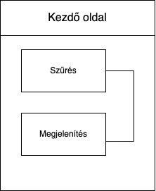
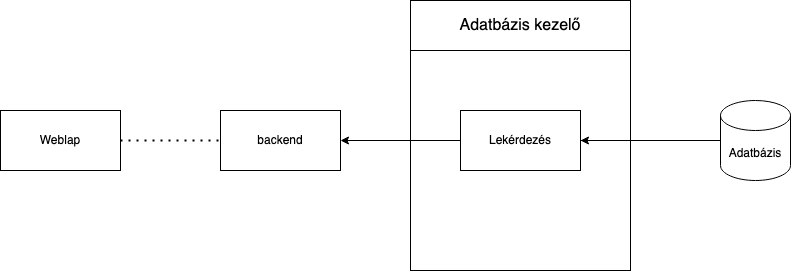

# Rendszerterv  

## A rendszer célja !!!TÜNDE!!!

## Projektterv !!!TÜNDE!!!
### Elvégzendő feladatok
### Felelősségi körök
### Mérföldkövek
### Ütemterv
#### Programozáshoz kötődő feladatok ütemterve
### Programozáshoz nem kötődő feladatok ütemterve

## Üzleti folyamatok modellje !!!TÜNDE!!!

## Követelmények !!!TÜNDE!!!
### Funkcionális követelmények
### Nem-funkcionális követelmények
### Törvényi előírások, szabványok

## Funkcionális terv 
### Felhasználói felület

A felhasználói felület egy weblap, amin a felhasználó bejelentkezés nélkül korlátozott tartalmat kap. Bejelentkezésnél három szerepkör közül tud választani, annak függvényében, hogy melyikhez tartozik.
A weblapok között egy navigációs menü segítségével válthatunk.
#### Nem bejelentkezett felhasználók lapja
##### Kezdő oldal
###### Funkciòk
- Bejelentkezés
- Regisztráció

A fő oldalon egy tájékoztató szöveget olvashatunk el. 
Bejelentkezés nélkül semmilyen adatot nem jelenít meg az oldal.
A navigációs menüben a bejelentkezésre kattintva tudunk bejelentkezni, vagy regisztrálni.

#### Diák felhasználó
##### Kezdő oldal
###### Funkciòk
- Közösségi szolgálati munkák megjelenítése
- gyors kereső
- részletes keresés
- kijelentkezés

A megjelenített adatok dinamikusan, mindig az adatbázis jelenlegi állapotát tükrözik.
A gyors keresővel kulcs szavakra tudunk rákeresni.
A részletes keresővel tudunk szűrni településre, megyére vagy kategóriára.A keresés gombbal a felhasználó által választott kritériumokkal szürt eresményeket listázza ki.
A menüben lévő kijelentkezés gombbal tudunk kijelentkezni a profilunkból.

##### profil oldal
###### Funkciòk
- profil szerkesztése
- mentés
- Saját válalt munkák megtekintése
- üzenet írás/ megtekintés
- kijelentkezés

A profil oldalon egy navigációs menüben kiválaszthatjuk mit szeretnénk.
A profil szerkesztésénél megtekinthetjük azt adatainkat és szerkeszthetjük őket. A mentés gombbal elmenthetjük a változtatásokat.
A diákok megtudják tekinteni a munkákban szerzett óráik számát és ennek dokumentumát kitudják nyomtatni pdf formátumban.
A menüben lévő kijelentkezés gombbal tudunk kijelentkezni a profilunkból.

#### Szervezet felhasználó
##### Kezdő oldal
###### Funkciòk
- a szervezet által feltöltött munkák megjelenítése
- gyors kereső
- részletes keresés
- új közösségi szolgálati munka oldal megnyitása
- kijelentkezés

A gyors és a részletes keresővel tudunk szűrni a munkákra.
A menüben lévő kijelentkezés gombbal tudunk kijelentkezni a profilunkból.

##### új kösösségi szolgálat
###### Funkciòk
- mentés

Ezen az oldalon az új munka adatait lehet beírni és elmenteni.

##### Profil oldal
###### Funkciòk
- adatok szerkesztése és mentése
- jelenléti ívek szűrese
- jelenléti ív megtekintése/ szerkesztése /pdf nyomtatása
- üzenet küldés/ fogadás
- kijelentkezés

A szervezetnek van lehetősége szerkeszteni és elmenteni az adatait.
A jelenléti iveket a szervezet meghírdetett munkái szerint kitudja listázni. A diák nevére kattintva tudja a jelenléti ívet módosítani, elmenteni és kinyomtatni.
Az üzeneteknél a diákok által írt leveleket tudják megtekinteni,visszaírni.
A diákok jelentkezését a munkára a szolgáltatók levél formátumban kapják meg amit eltudna utanítani és elfogadni.

#### Iskola

##### Kezdő oldal
###### Funkciók

### Adatbázis kezelő
Az adatbázis kezelő felelős az adatbázissal való közvetlen kommunikációért.
Elvégzi a lekérést, majd továbbitja az adatokat.
Az összes adatbázis az adatbázis kezelőn keresztül érhető el.

#### Adatbázis kezelő funkciói
Az adatbázis kezelő lekérdezést az egész adatbázishoz biztosít.

### Backend
A backend feladata összekötni a weblapot, az adatbázis kezelőt.

A backend a felhasználói felületen beállítottak szerint jelzi az adatbázis kezelőnek milyen adatokra van szükség, majd a kapott adatokat megjeleníti a weblapon.

## Fizikai környezet
A fizikai környezet részei a webes front-end, ami megjeleníti az adatokat, a php backed, ami biztosítja az adatbázis elérését, az sql adatbázisok, amik az adatok tárolásáért és lekéréséért felelősek.
### Webes felület
A webes felület felelős az adatok megjelenítéséért a felhasználó számára, ezért fontos, hogy könnyen átlátható, könnyen kezelhető és bármilyen eszközről megjeleníthető legyen.
#### Felépítés
A webes felület kialakításához a Vue.js 3 JavaScript keretrendszert alkalmazzuk.

#### Reszponzivitás
A reszponzivitás megvalósításához bootstrap-et használunk, mivel a bootstrap egy elterjedt és jól bevált technológia. 

### Backend-program
Összeköti a komponenseket. A weboldal backendjét php nyelven írjuk.

### Adatbázis
SQL adatbázisok felelősek az adatok tárolásáért.

### A megvalósítandó alkalmazás
A megvalósítandó alkalmazás egy webalkalmazás. Vagyis bármilyen webböngészővel rendelkező eszközről elérhető és használható. A reszponzivitás megvalósításával eszközmérettől függően változik a megjelenítés így tovább növelve az elérhetőségét.

## Absztrakt domain modell !!!TÜNDE!!!
### Domain specifikáció, fogalmak
#### Fogalmak:
### Absztrakt komponensek, ezek kapcsolatai
#### Absztrakt komponensek:
#### Kapcsolatok:

## Architekturális terv !!!BOGI!!!
### Egy architekturális tervezési minta 
Az alkalmazás architekturális tervezési mintája segít az alkalmazás szervezésében és az egyes komponensek közötti kapcsolatok meghatározásában. Egy jól megválasztott minta növelheti az alkalmazás skálázhatóságát, karbantarthatóságát és kiterjeszthetőségét.
### Az alkalmazás rétegei, fő komponensei, ezek kapcsolatai
#### Alkalmazás rétegei:
- Felhasználói felület réteg:
  - Felhasználói interfész (UI): A webes alkalmazás ezen rétege felelős az alkalmazás felhasználói felületének megjelenítéséért. A felhasználók itt kezdeményezik a különböző lekérdezéseket, megadhatják a kívánt szűrőket és megjelenítik az eredményeket.

- Üzleti logika réteg:
  - Lekérdezés-szolgáltatás: Ebben a rétegben található a logika a felhasználói kérések feldolgozásához és az adatbázisokhoz való kapcsolódáshoz. A szolgáltatás lehetővé teszi a felhasználók számára, hogy lekérdezzék az adatbázis adatait.

- Adatbázis réteg:
  Az adatbázis négy táblát tartalmaz.
  - Diak: A diákok személyes adataikat tartalmazza.
  - Iskola: Ez a tábla az iskolák adatait tartalmazza és összeköti a diákokat a szolgáltatókkal.
  - Szolgaltato: A Szolgáltató adataikat tartalmazza.
  - Munka: A szolgáltatók által meghírdetetett munkák adatait tartalmazza.

#### Architekturális séma:

### Változások kezelése

Az alábbi szempontok fontosak a változások hatékony kezeléséhez:

- Automatikus frissítések:
  - Érdemes automatikus frissítési mechanizmusokat bevezetni, amelyek rendszeresen ellenőrzik az adatforrásokat, és frissítik az alkalmazás adatbázisát vagy adatokat.

- Felhasználói visszajelzés:
  -A weboldalnak lehetőséget kell biztosítania a felhasználóknak a visszajelzés küldésére. Ez segíthet az alkalmazás fejlesztésében és javításában is.

- Hibajavítás:
  - Reagállni kell a hibajelentésekre, és problémákra, különösen akkor, amikor fontos változások történnek a járványügyi helyzetben.

- Jogszabályi változások:
  - Ha jogszabályi változások történnek, például az adatvédelem előírások terén, az oldalnak alkalmazkodnia kell ezekhez a változásokhoz.

- Tesztelés és visszajelzés:
  - Az új funkciókat, változásokat alaposan tesztelni kell, mielőtt élő rendszerbe kerülnének.
### Rendszer bővíthetősége
A rendszer bővíthetősége kulcsfontosságú a hosszú távú sikerhez, mivel lehetővé teszi az alkalmazás funkcióinak és képességeinek kibővítését az új igények és technológiai fejlesztések alapján.

Folyamatos fejlesztések és frissítések szükségesek ahhoz, hogy az új funkciók és fejlesztések az aktuális igényekhez igazodjanak.

### Biztonsági funkciók
Az alkalmazásnak szigorú adatvédelmi politikával kell rendelkeznie, és megfelelő intézkedéseket kell tenni az érzékeny felhasználói adatok védelme érdekében.

## Adatbázis terv 
**Megjegyzés - Ez még nem a végleges tervünk az adattárolásra. Terveink az alkalmazás fejelsztése alatt változhatnak, és ezt ezen pont frissítésével jelezni fogjuk.**
Terveink szerint az alkalmazásunk egy adatbázist fog alkalmazni ahhoz, hogy megfelelően működjön minden. Ehhez 4 külön táblára lesz szükségünk:

Diák
Iskola
Szervezet
Munka

### A Diák adatbázis felépítése
Ez a tábla tartalmazza azokat a diákok adatait. Ezen adatok a következők:

| Mező           | Típus           | Leírás                             |
|----------------|-----------------|------------------------------------|
| id             | int             | Azonosító, elsődleges kulcs        |
| keresztnev     | string          | Diák kereszt neve                  |
| vezeteknev     | string          | Diák vezeték neve                  |
| felfasznalonev | string          | Diák felhasználó neve              |
| jelszo         | varchar         | Jelszót tartalmazó mező            |
| email          | varchar         | Email címet tartalmaző mező        |
| iskola         | string          | Diák Iskolájának  neve             |
| telefonszam    | int             | Diák telefonszámát tartalmazó mező |
| megye          | varchar         | Lakcímében szereplő megye neve     |
| om_azonosito   | int             | Diák OM Azonosítója                |
| varos          | varchar         | Lakcímében szereplő város neve     |
| irányitoszam   | int             | Lakcímében szereplő irányítószám   |
| utca_hazszam   | varchar         | Lakcímében szereplő utca, házszám  |
| munkakor       | varchar         | Diákok által preferált munkakör    |

### A Iskola adatbázis felépítése
Ez a tábla tartalmazza az iskolák adatait. Ezen adatok a következők:

| Mező             | Típus           | Leírás                               |
|------------------|-----------------|--------------------------------------|
| id               | int             | Azonosító, elsődleges kulcs          |
| nev              | string          | Iskola neve                          |
| felfasznalonev   | string          | Iskola felhasználó neve              |
| jelszo           | varchar         | Jelszót tartalmazó mező              |
| email            | varchar         | Email címet tartalmaző mező          |
| telefonszam      | int             | Iskola telefonszámát tartalmazó mező |
| megye            | varchar         | Lakcímében szereplő megye neve       |
| varos            | varchar         | Lakcímében szereplő város neve       |
| irányitoszam     | int             | Lakcímében szereplő irányítószám     |
| utca_hazszam     | varchar         | Lakcímében szereplő utca, házszám    |
| iksz_koordinator | varchar         | Iskola IKSZ koordinátota             |
| iksz_elerhetoseg | varchar         | Iskola IKSZ koordinátor elérhetősége |

### A Szervezet adatbázis felépítése
Ez a tábla tartalmazza a szervezetek adatait. Ezen adatok a következők:

| Mező             | Típus           | Leírás                                  |
|------------------|-----------------|-----------------------------------------|
| id               | int             | Azonosító, elsődleges kulcs             |
| nev              | string          | Szervezet neve                          |
| felfasznalonev   | string          | Szervezet felhasználó neve              |
| jelszo           | varchar         | Jelszót tartalmazó mező                 |
| email            | varchar         | Email címet tartalmaző mező             |
| telefonszam      | int             | Szervezet telefonszámát tartalmazó mező |
| megye            | varchar         | Lakcímében szereplő megye neve          |
| varos            | varchar         | Lakcímében szereplő város neve          |
| irányitoszam     | int             | Lakcímében szereplő irányítószám        |
| utca_hazszam     | varchar         | Lakcímében szereplő utca, házszám       |
| munkakor         | varchar         | Szervezet munkaköre                     |

### A Munka adatbázis felépítése
Ez a tábla tartalmazza a kösösségi szolgálati munka adatait. Ezen adatok a következők:

| Mező             | Típus           | Leírás                                  |
|------------------|-----------------|-----------------------------------------|
| id               | int             | Azonosító, elsődleges kulcs             |
| nev              | string          | Munka neve                              |
| email            | varchar         | Email címet tartalmaző mező             |
| telefonszam      | int             | Szervezet telefonszámát tartalmazó mező |
| megye            | varchar         | Lakcímében szereplő megye neve          |
| varos            | varchar         | Lakcímében szereplő város neve          |
| irányitoszam     | int             | Lakcímében szereplő irányítószám        |
| utca_hazszam     | varchar         | Lakcímében szereplő utca, házszám       |
| munkakor         | varchar         | Szervezet munkaköre                     |
| Szolgaltato      | int             | külső kulcs a szervezet táblával        |

## Tesztterv 

### 1. Bevezetés

A tesztterv célja, hogy biztosítsa az ötven óra közösségi szolgálati munka alkalmazás megfelelő működését, az összes funkcionalitás és követelmény szerint. A tesztek a következő területekre összpontosítanak:

- Általános funkcionalitás tesztelése.
- Felhasználói felület tesztelése.
- Adatbázis működésének tesztelése.
- Biztonsági tesztek.

### 2.Tesztelendő Funkciók

#### 2.1 Általános Funkcionalitás

- szűrések elvégzése és eredmények megjelenítése.
- Munkára jelentkezés tesztelése.
- Munka jelentkezés elfogadása/ elutasítása.
- Munka leírás módosítása/törlése/létrehozása.
- Üzenet / válaszüzenet küldée.

#### 2.2 Felhasználói Felület

- A felhasználói felület általános használhatóságának tesztelése.
- A képernyők megfelelő megjelenítésének és navigációjának ellenőrzése.
- munkára létrehozása/ jelentkezése tesztelése.
- Bejelentkezési felület tesztelése.

#### 2.3 Adatbázis

- Az adatbázis kezelő legyen képes elvégezni a lekéréseket.
- Az adatbázis kezelő legyen képes továbbítani a lekért adatokat a weboldal felé.
- Az adatbázis kezelő biztosítson lekérdezési engedélyt mindkét adatbázisnak.

#### 2.4 Biztonság

- Biztonsági tesztek végrehajtása az adatbázis és a felhasználói adatok védelme érdekében.

### 3. Tesztek Futtatása

  Minden tesztesetet végre kell hajtani a fejlesztés és az alkalmazás kiadása előtt. A tesztek függetlenek kell legyenek egymástól, és egymás után is futtathatók, hogy külön-külön és együtt is tesztelhessük a rendszert.

### 4. Teszteredmények Rögzítése

  A tesztek futtatása során rögzíteni kell az eredményeket, beleértve a sikeres és sikertelen teszteseteket is. A hibákat és problémákat dokumentálni kell, hogy a fejlesztők kijavíthassák azokat.

### 5.Hibajavítás és Újraellenőrzés

  A tesztek eredményeinek alapján a talált hibákat javítani kell, majd újraellenőrizni a rendszert a javítások után.

### 6. Elfogadási Teszt

  Az elfogadási teszt során az alkalmazást a végfelhasználók is tesztelik, és visszajelzéseik alapján lehetőség szerint további javításokat végeznek.

## Telepítési terv

A szoftverünk egy webes alkalmazá ami böngészőböl fut.
Az  oldal eléréséhez egy regisztrálu utl-re  van szükségünk amelyet megtekinthetünk böngészőköl.
például:
- Chrome
- Firefox
- Edge
- Opera
- Safari
Telefonról megtenkintve is megfelelően működik az oldal.
